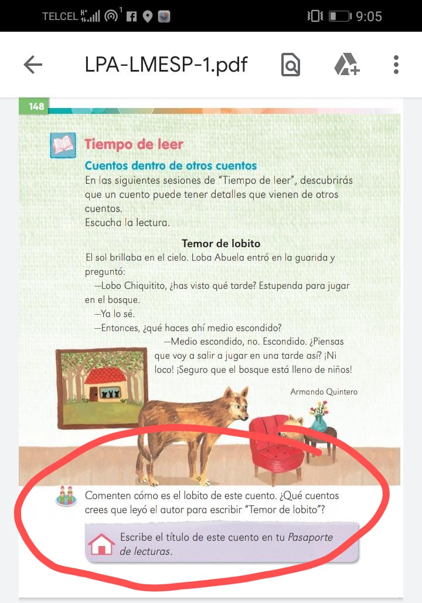

# Actividades

## 20 de Abril 

### Español

* Nos quedamos en la página 147 de su libro, Asi era antes, asi soy ahora
* Primero ponen fecha en su cuaderno azul y copian las preguntas que harán de entrevista son 3, pueden anexar otras 2.
* La entrevista la harán a sus padre o sus abuelos para saber que cambios han tenido al crecer.
* Responden esa pregunta ahí mismo en el libro
* Por último ahí en su cuaderno, con su ayuda harán una pequeña línea del tiempo, utilizando dibujos  , pueden organizarlo en cuadros pequeños, fechas y dibujos
    * Empezando si recuerdan desde que nacieron, cuándo caminaron, cuándo les salió su primer diente etc... Hasta llegar a lo actual

## 21 de Abril

### Matematicas

* Página 144 de su libro de matemáticas así como esta hay que resolverla ahí mismo en su libro
* En la 145, nos pide trabajar con fichas azules y rojas, cómo quizá en casa no tengamos las fichas puedes realizarlas de papel y ellos las pueden colorear y así podemos realizar éste trabajo.
    * Así cómo contestar las preguntas de abajo

## 22 de Abril

### Español

* Lectura página 148
    * Vamos a leer (si ellos pueden leer solos, estaría perfecto) ese pequeño cuento, seguir las indicaciones. 
    * Lo que está encerrado con rojo hay que hacerlo en el cuaderno porfavor
    
    
    
* Lectura página 149
    * Vienen muy repetitivos los temas, otra vez mayúsculas y minúsculas. Las preguntas que están encerradas con azul también van en su cuaderno azul, no olviden poner fecha.
    * Por último hay que hacer un dictado en su cuaderno morado que contenga 10 palabras y 5 enunciado, denotando la mayúscula y minúscula (utilicen nombres propios, de cuidades, explicar cuando una oración inicia es con mayúscula y cuando termina es con punto, las palabras que lleven tilde hay que ponerlo, etc)
    
    
