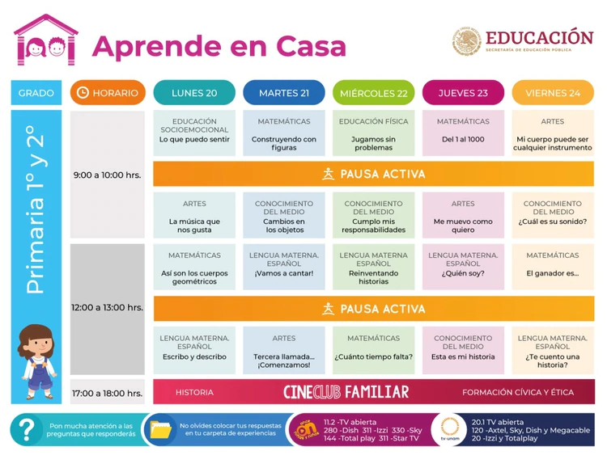
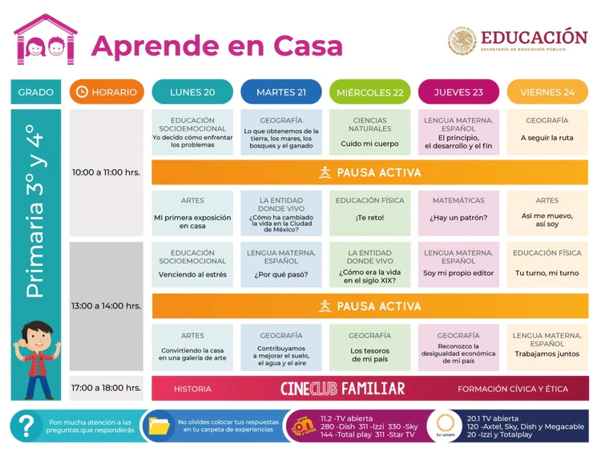

# AprendeEnCasa

## Sitio

* [AprendeEnCasa](https://www.aprendeencasa.mx)

## Carpeta

* [Carpeta de experiencias](https://www.youtube.com/watch?v=DG6FTWq1ZoQ&app=desktop)

## Transmisiones en vivo

* [Retransmisión](https://www.youtube.com/channel/UC_KUp7kSGFCaSKYVqv2qNMQ)
* [Retransmisión2](https://tv.unam.mx/en-vivo/)

## Calendarios

* [1ro](CALENDARIO-CÁLCULO-PRIMERO-ABRIL-2020.pdf)
* [3ro](CALENDARIO-CÁLCULO-TERCERO-ABRIL-2020.pdf)

## Programación

* 1ro y 2do

* 3ro y 4to

